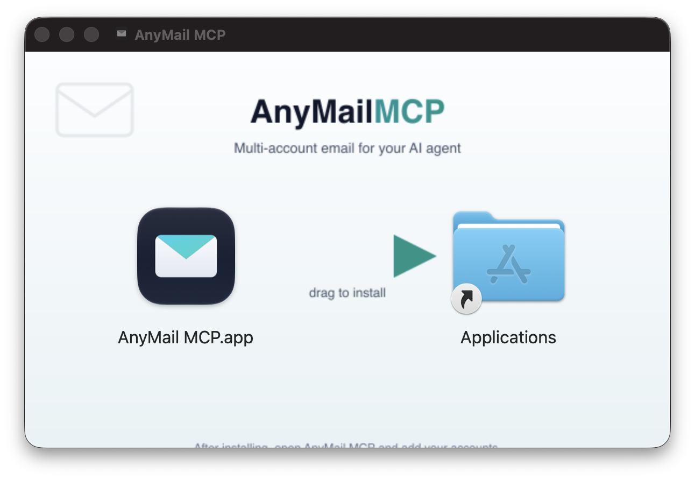
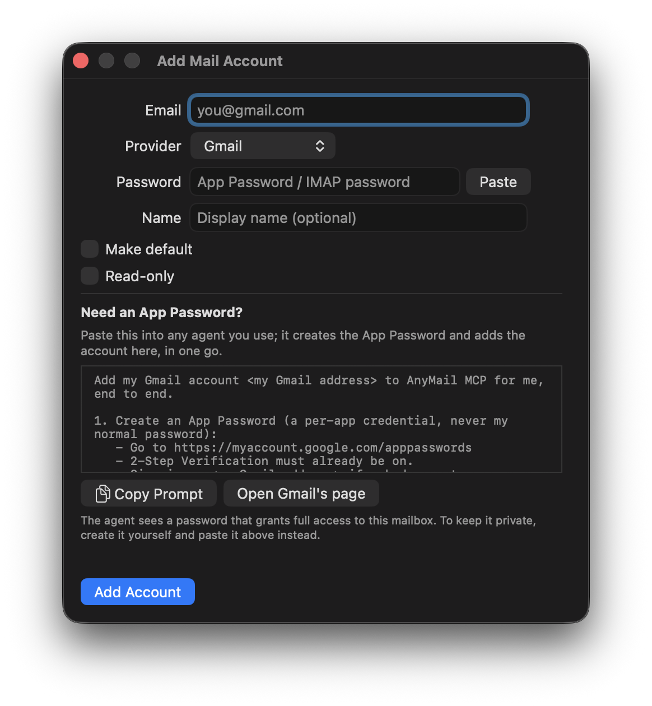

# AnyMail MCP

**Connect all your email accounts to your AI agent, not just one.** A local
[MCP](https://modelcontextprotocol.io) server that lets an agent (Claude Code,
Claude Desktop, Cursor, VS Code, Windsurf) search, read, send, organize, and
delete mail across **multiple mailboxes at once**, over IMAP/SMTP. Works with
Gmail, iCloud, Fastmail, or any IMAP host. Every credential stays on your machine.


## Why AnyMail MCP exists

Connecting your mail to an AI agent usually means **one account at a time**, a
single Gmail or a single Microsoft 365 mailbox. But most people live across
several inboxes: personal, work, a side project, an old address that still gets
the important stuff. AnyMail MCP removes that limit. Connect every account you
have, across providers, and your agent can search, triage, draft, send, label,
and clean up across **all of them** in a single session, while every credential
stays on your machine.

> **Pre-1.0 release candidate.** It works, but interfaces may still change
> without notice. Authentication is via **App Passwords**; Microsoft 365 /
> Outlook and OAuth sign-in are on the [roadmap](#roadmap).

## Install the app (macOS)



The menu-bar app is the no-terminal path: it supervises the engine, gives you an
**Add Account** window, an **Install into Agents** button, and **Start at Login**.

1. **Download** `AnyMail-MCP-<version>-universal.dmg` from the
   [latest release](https://github.com/MarcinWalendowski/anymail-mcp/releases/latest).
   One universal build runs on both Apple Silicon and Intel, and Node is bundled
   inside, so there are no prerequisites to install.
2. **Open the DMG and drag** AnyMail MCP to your Applications folder.
3. **First open is blocked.** The app is ad-hoc signed, not yet notarized, so
   macOS refuses the first launch. To allow it: open **System Settings > Privacy
   & Security**, scroll to the "AnyMail MCP was blocked" notice, click **Open
   Anyway**, and confirm. macOS remembers the choice.
   <details><summary>Advanced: clear the quarantine flag from the terminal instead</summary>

   ```bash
   xattr -dr com.apple.quarantine "/Applications/AnyMail MCP.app"
   ```
   </details>
4. **A mail icon appears in the menu bar.** Open **Add Account** and connect your
   mailboxes. Each account needs an [App Password](#get-an-app-password) (not your
   normal password). The first time an account's password is read, macOS shows a
   Keychain **Always Allow** prompt, click it once. (It re-prompts after each app
   update while builds are ad-hoc signed; a notarized release will end that.)

That's the last DMG you'll download: the app **updates itself** (it checks on
launch, every 6 hours, and when you open the menu, and installs updates
automatically; there's also a "Check for Updates" item in the menu). Updates
are cryptographically verified against a key pinned in the app, so only
releases signed by the maintainer are ever installed.



The Add Account window covers **Gmail, iCloud, Fastmail, or a custom IMAP host**
(the provider picker reveals host/port fields for the custom case). The App
Password never touches the app: it is posted once to `127.0.0.1` and the engine
stores it in the Keychain. If you don't have an App Password yet, the window
shows a ready-to-run prompt you can copy into any agent, which creates the
password and registers the account in one paste (that path makes the password a
tool-call argument, so the window flags the trade-off inline).

## Or set up the CLI

For anyone comfortable in a terminal, one line clones, builds the engine, and
registers it into every agent it detects:

```bash
git clone https://github.com/MarcinWalendowski/anymail-mcp.git && cd anymail-mcp && ./scripts/setup-cli.sh --install-agents
```

Then add your first account:

```bash
node dist/index.js add you@gmail.com --default
```

That's the whole setup. `node dist/index.js help` lists everything else: more
accounts, other providers (iCloud, Fastmail, any IMAP host), read-only accounts,
and `test` / `list`. On **Windows**, run `npm ci && npm run build` in place of
the setup script; the engine runs on macOS, Windows, and Linux.

## Or paste a prompt to your agent

Your agent already has a terminal, so it can run the setup itself. Paste this
into Claude Code, Cursor, or any coding agent:

```text
Install the AnyMail MCP email server for me. Clone
https://github.com/MarcinWalendowski/anymail-mcp, then from the repo root run
./scripts/setup-cli.sh --install-agents to build the engine and register it
into my agents. Confirm it worked with node dist/index.js help, then tell me
how to add my first mail account.
```

Restart the agent when it's done, then connect a mailbox via the [App
Password](#get-an-app-password) flow, or just ask the agent to walk you through
it.

---

## What it can do

Full CRUD across every connected account:

| Kind | Operations |
|------|-----------|
| **Read** | list accounts · search · read message · read thread *(Gmail)* · list labels *(Gmail)* · fetch attachments |
| **Create** | send · save draft · create label · add an account (`add_account`) |
| **Update** | add/remove labels · read/unread · star/unstar · archive · move |
| **Delete** | trash (reversible) · permanent delete (explicit `confirm:true`) |
| **Bulk** | one call acts on *every* message matching a query: `mark_all_read` · `bulk_modify_labels` · `bulk_move` · `bulk_trash` · `bulk_delete` · `empty_spam` · `empty_trash` |

Every tool takes an optional `account` (the email address); omit it to use your
default account.

### Cleaning up in bulk

The bulk tools are **query-first**: they take `{ query?, mailbox?, dryRun?, confirm?, max? }`
and act on the whole matching set in one pass, instead of one tool call per
message. So "mark everything from this sender as read" or "trash every promo
older than a year" is a single call.

- `dryRun:true` previews the matched count and a small sample, changing nothing.
- Destructive or large (>100-message) batches require `confirm:true`.
- Per-message failures are reported, never hidden.
- Spam and Trash are reachable via the `mailbox` param (e.g. `mailbox:'[Gmail]/Spam'`).

For very large clean-ups, the removing ops (`bulk_trash` / `bulk_move` /
`bulk_delete` / `empty_*`) act on up to `max` messages per call (default **2000**)
and return `{ matched, affected, remaining, done }`. When `done` is `false`, just
re-run the **same call** until it's `true`. Acted-on messages leave the search
scope, so it resumes cleanly, and a 10k-message sweep never trips your agent's
tool timeout.

## Providers

Every provider speaks IMAP/SMTP, so the core (search, read, send, draft, move,
archive, trash, delete, attachments, and the bulk tools) works everywhere. What
differs is what the underlying protocol exposes:

| | **Gmail** | **iCloud** · **Fastmail** · **any IMAP host** |
|---|---|---|
| Status | Fully supported | Works, smaller feature set |
| Organizing | **Labels**, many per message (`modify_labels`) | **Folders**, one per message (`move` / `archive`) |
| Search | **Native Gmail syntax** (`from:x has:attachment older_than:1y`) | Server-side **text match** only |
| Threads | `get_thread` | Not available |
| Add it with | *(default)* | `--provider icloud` · `--provider fastmail` · `--provider imap --imap-host ... --smtp-host ...` |

Presets ship for Gmail (`imap.gmail.com`), iCloud (`imap.mail.me.com`, STARTTLS on
587) and Fastmail (`imap.fastmail.com`); `--provider imap` takes any host/port.
`list_accounts` reports each account's provider, so an agent can tell which rules
apply before it acts. Mixing is the point: a Gmail work account and an iCloud
personal account can be connected at the same time, and every tool takes an
optional `account` to pick between them.

## Get an App Password

Each provider wants an **App Password**, a per-app credential you create once,
after turning on two-factor auth. Never your normal password.

| Provider | Where to create it | Notes |
|----------|--------------------|-------|
| **Gmail** | <https://myaccount.google.com/apppasswords> | Needs **2-Step Verification** on first. IMAP is always-on, nothing else to toggle. |
| **iCloud** | <https://account.apple.com> → Sign-In and Security → App-Specific Passwords | Needs **two-factor authentication** on the Apple Account. |
| **Fastmail** | Settings → Password & Security → App Passwords | Scope it to **IMAP + SMTP**. |
| **Other IMAP** | Your host's control panel | Some hosts also require enabling IMAP access explicitly. |

An App Password is stored only in your Keychain, never in the repo or a response.
See [SECURITY.md](SECURITY.md) for its blast radius and how to revoke or scope it.

## Connect it to your agent

`node dist/index.js install` (or the app's **Install into Agents** button) writes
the right config for each agent it detects:

| Agent | Transport | What gets written |
|-------|-----------|-------------------|
| Cursor · Claude Code · VS Code · Windsurf | **HTTP** | local URL + `Authorization: Bearer <token>` |
| Claude Desktop | **stdio** | spawn command (its own engine, same Keychain) |

Restart the agent afterward, then ask it to `list_accounts`.

## Security model

The engine can read, send, and **delete** your mail, so the always-on server is
locked down. Three things worth knowing (full detail in [SECURITY.md](SECURITY.md)):

- **Nothing off-machine can reach it.** The server binds `127.0.0.1` only,
  requires a bearer token on every request, and validates `Origin` to defend
  against DNS-rebinding.
- **Credentials stay on-device.** App Passwords live only in the OS credential
  store (macOS Keychain, Windows Credential Manager, Linux Secret Service); they
  never appear in any response or log.
- **Destructive actions are gated.** Per-account read-only mode, `confirm:true`
  on permanent delete, and a `dryRun` preview on the bulk tools.

## Roadmap

- [x] **Generic IMAP providers**: iCloud, Fastmail, and any IMAP host work via
      `--provider` ([smaller feature set](#providers): folders not labels,
      text-only search, no threads).
- [x] **Downloadable universal DMG**: one macOS app for Apple Silicon and Intel
      with Node bundled inside, no prerequisites. Ad-hoc signed today; Developer
      ID signing and notarization are next (see [docs/DISTRIBUTION.md](docs/DISTRIBUTION.md)).
- [x] **Windows & Linux CLI**: the engine runs cross-platform, using each OS's
      native credential store.
- [ ] **Richer search for IMAP providers**: map the common Gmail-style operators
      (`from:`, `subject:`, `has:attachment`, date ranges) onto IMAP SEARCH, so a
      query behaves the same across accounts.
- [ ] **More providers**: Microsoft 365 / Outlook (needs OAuth), Yahoo.
- [ ] **OAuth sign-in**: connect an account with a normal "Sign in with Google /
      Microsoft" flow instead of manually creating App Passwords.
- [ ] **One-click install**: a notarized DMG (opens without the Gatekeeper
      warning) and a Homebrew cask.
- [ ] **`npm` / `npx` distribution** for the CLI/engine.

## How it works

```
Agent (Claude Code / Desktop / Cursor ...)
   │  MCP over stdio or HTTP (127.0.0.1)
   ▼
AnyMail MCP engine  (local Node process)
   │  one provider per account, chosen from the account's `provider`
   │
   ├─ GmailProvider  ── ImapFlow → imap.gmail.com:993     (+ X-GM-* : labels, threads, raw search)
   │                    Nodemailer→ smtp.gmail.com:465
   │
   └─ ImapProvider   ── ImapFlow → imap.mail.me.com:993   (iCloud / Fastmail / any host)
                        Nodemailer→ smtp.mail.me.com:587    folders, IMAP SEARCH
   ▼
Each account authenticated with its own App Password, read from the Keychain
```

`GmailProvider` extends `ImapProvider`, so Gmail is the generic IMAP behaviour plus
the `X-GM-*` extensions. Adding a provider means extending `ImapProvider` and adding
a preset, see [`src/providers/`](src/providers/).

Why IMAP/SMTP + App Passwords instead of the Gmail HTTP API: full-CRUD Gmail API
access needs *restricted* OAuth scopes, which for personal `@gmail.com` accounts
forces Google app verification plus an annual CASA security assessment (or a 7-day
token expiry in Testing mode). App Passwords + IMAP sidestep all of it and run
fine in a local process, and IMAP needs a long-lived TCP socket, so this can't
be a serverless function anyway. The macOS app internals live in
[`app/BUILD.md`](app/BUILD.md); the distribution pipeline (bundled engine, DMG,
notarization path) is in [`docs/DISTRIBUTION.md`](docs/DISTRIBUTION.md).

## Contributing

Issues and PRs welcome, see [CONTRIBUTING.md](CONTRIBUTING.md). The release
process is in [RELEASING.md](RELEASING.md).

## License

[MIT](LICENSE) © Marcin Walendowski
